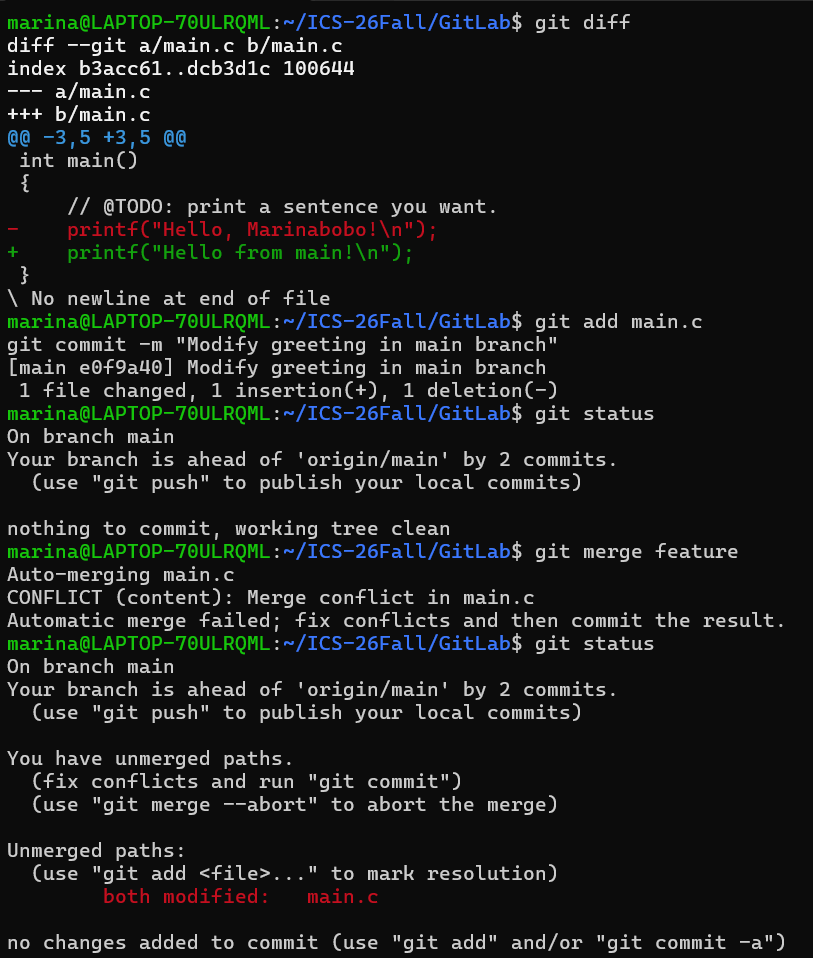
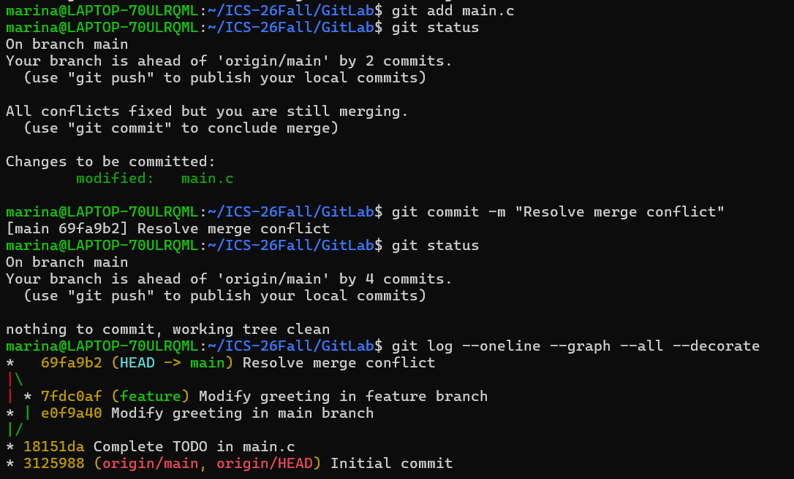

# Lab0: GitLab 实验报告

## 一、实验目的

本实验主要用于学习 Git 和 GitHub 的基本使用方法，理解版本控制、暂存区、提交、分支和合并等基本概念，并通过实际操作掌握从创建仓库、克隆仓库、修改文件、提交修改，到创建分支和解决合并冲突的完整 Git 工作流程。

通过本次实验，我希望能够理解 Git 不只是用于保存代码，还能够记录项目的修改历史，并支持多人在不同分支上协同开发。

---

## 二、Git 基础问题

### 1. 你之前有过多人协同开发的经历吗？如果有，你们是使用什么方式分工协作的？

此前在课程或项目中有过小组合作的经历，但之前的协作方式主要是按照任务进行人工分工，例如不同成员分别完成不同部分，再通过聊天软件或共享文件进行汇总。

这种方式在项目较小时比较简单，但当多人需要同时修改同一份代码时，容易出现版本混乱、文件被覆盖以及难以确定最新版本等问题。

通过本次实验，我了解到 Git 可以通过 commit 记录每一次修改，并利用 branch 让不同成员在独立分支中进行开发，最后再通过 merge 将修改合并。因此，Git 更适合进行多人协同的软件开发。

### 2. Git 为什么要设计“暂存—提交”两个步骤？

Git 没有在文件修改之后直接提交，而是在工作区和本地仓库之间设计了一个暂存区（Staging Area）。

例如，如果我同时修改了 `main.c`、`README.md` 和其他文件，但本次只希望提交 `main.c` 的修改，就可以执行：

`git add main.c`

只将 `main.c` 放入暂存区，再执行 `git commit`。

因此，暂存区可以让开发者在正式提交之前选择本次 commit 中到底包含哪些修改，使一次 commit 对应一个相对完整、明确的修改内容。

本次实验中，我实际经历的流程为：

修改文件 → `git diff` 检查修改 → `git add` 加入暂存区 → `git commit` 创建版本记录。

通过实际操作，我更加理解了暂存区相当于正式提交前的一次筛选过程。

### 3. `git branch` 和 `git branch -a` 有什么区别？

`git branch` 主要用于查看本地仓库中的分支。

例如：

`git branch`

在本次实验中会显示：

- `main`
- `feature`

其中带 `*` 的分支表示当前所在的分支。

而：

`git branch -a`

除了显示本地分支之外，还会显示远程跟踪分支，例如：

`remotes/origin/main`

因此，两者的主要区别是：

- `git branch`：查看本地分支；
- `git branch -a`：查看所有分支，包括本地分支和远程跟踪分支。

---

## 三、阅读材料总结

### 1. Commit Message 规范

阅读 Commit Message 相关材料后，我了解到 commit message 不只是对一次提交随意写一句备注，而是项目版本历史的重要组成部分。

清晰、规范的 commit message 可以让开发者通过 Git 历史快速了解每次提交进行了什么修改。在多人合作时，其他成员也可以通过提交记录了解代码发生变化的原因。

规范的 commit message 通常可以区分不同类型的修改，例如：

- `feat`：增加新功能；
- `fix`：修复问题；
- `docs`：修改文档；
- `refactor`：代码重构；
- `test`：测试相关修改。

规范的提交记录不仅便于查看项目历史，还能够帮助项目生成 Change Log。

在本次实验中，我使用了：

`Complete TODO in main.c`

`Modify greeting in feature branch`

`Modify greeting in main branch`

`Resolve merge conflict`

等 commit message。虽然这些提交比较简单，但已经可以从 Git 历史中直接判断每次提交完成了什么任务。

### 2. Git Flow 分支控制

Git Flow 是一种利用多个 Git 分支组织软件开发过程的方法。

不同类型的工作可以放在不同的分支中完成。例如稳定版本可以保存在主分支，新功能则可以在独立的 feature 分支中开发。功能完成后，再将 feature 分支合并回主要开发分支。

这种方式可以避免一个尚未开发完成的新功能直接影响稳定代码。

本次实验中，我实际使用了一个 `feature` 分支。在创建该分支后，我分别在 `main` 和 `feature` 中修改 `main.c`，两个分支互不影响。最后再通过 `git merge feature` 将 feature 合并到 main。

因此，通过这次实验，我对“分支是不同的开发路线”这一概念有了更加直观的认识。

### 3. 为什么要学习 Git

我认为学习 Git 的意义不仅是学会几个命令，而是学习一种管理项目修改过程的方法。

在个人开发中，Git 可以记录代码的修改历史，在出现问题时帮助开发者找到之前的版本。

在多人协作中，Git 可以让不同开发者通过分支同时工作，并记录每个人的修改，降低直接覆盖代码的风险。

同时，目前大量开源项目都托管在 GitHub 等平台上，Git 已经成为软件开发中非常基础的工具。因此，掌握 Git 对之后完成课程项目、参与科研项目以及进行软件开发都有帮助。

---

## 四、实验过程

### 1. 使用模板创建个人仓库

首先进入课程提供的 GitHub 模板仓库，通过 `Use this template` 创建自己的仓库：

`Marinabobo/GitLab`

创建仓库时没有使用 Fork，并保留了模板中的 `.github/workflows` 文件。

---

### 2. 配置 GitHub SSH

为了通过 SSH 访问 GitHub，我首先检查了本机已有的 SSH 密钥，并将公钥添加到了 GitHub 账户。

之后使用：

`ssh -T git@github.com`

进行测试，终端显示：

`Hi Marinabobo! You've successfully authenticated, but GitHub does not provide shell access.`

说明 SSH 身份验证配置成功。

---

### 3. Clone 仓库

在 WSL Ubuntu 中建立课程目录：

`~/ICS-26Fall`

随后使用：

`git clone git@github.com:Marinabobo/GitLab.git`

将自己的 GitHub 仓库克隆到本地。

进入仓库后使用：

`git status`

检查仓库状态，此时位于 `main` 分支，并且工作区没有修改。

---

### 4. 完成 main.c 中的 TODO

使用 VS Code 打开仓库：

`code .`

将 `main.c` 中原来的：

`printf("Hello, world!\n");`

修改为：

`printf("Hello, Marinabobo!\n");`

修改后先使用：

`git status`

检查文件状态，再通过：

`git diff`

查看具体修改内容。

之后执行：

`git add main.c`

将修改加入暂存区，并通过：

`git commit -m "Complete TODO in main.c"`

创建第一次自己的 commit。

本次提交的 commit 为：

`18151da Complete TODO in main.c`

---

### 5. 创建 feature 分支

执行：

`git switch -c feature`

创建并切换到 `feature` 分支。

使用：

`git branch`

确认当前所在分支为 `feature`。

在 feature 分支中，将同一行修改为：

`printf("Hello from feature!\n");`

之后完成提交：

`git add main.c`

`git commit -m "Modify greeting in feature branch"`

对应 commit 为：

`7fdc0af Modify greeting in feature branch`

---

### 6. 在 main 分支进行不同修改

使用：

`git switch main`

重新切换到 `main` 分支。

此时再次修改 `main.c` 中相同位置，将其修改为：

`printf("Hello from main!\n");`

然后执行：

`git add main.c`

`git commit -m "Modify greeting in main branch"`

对应 commit 为：

`e0f9a40 Modify greeting in main branch`

此时 `main` 和 `feature` 两个分支分别对 `main.c` 的同一行进行了不同修改。

---

### 7. 制造 Merge Conflict

在 `main` 分支执行：

`git merge feature`

Git 无法自动判断同一行应该采用 `main` 分支还是 `feature` 分支的内容，因此终端出现：

`CONFLICT (content): Merge conflict in main.c`

`Automatic merge failed; fix conflicts and then commit the result.`

使用：

`git status`

可以看到：

`both modified: main.c`

说明 `main.c` 发生了合并冲突。

#### Merge Conflict 截图

---

### 8. 解决 Merge Conflict

发生冲突后，我在 VS Code 中手动检查两个分支的修改内容，并决定最终保留的代码。

解决冲突之后，使用：

`git add main.c`

将该文件标记为已经解决冲突。

此时执行：

`git status`

可以看到：

`All conflicts fixed but you are still merging.`

随后通过：

`git commit -m "Resolve merge conflict"`

完成合并。

对应 merge commit 为：

`69fa9b2 Resolve merge conflict`

最终执行：

`git status`

显示：

`nothing to commit, working tree clean`

说明冲突已经成功解决，合并完成。

#### 解决冲突后的截图

---

### 9. 查看分支历史

最后使用：

`git log --oneline --graph --all --decorate`

查看 Git 提交历史。

结果能够看到 `main` 和 `feature` 两条开发路线以及最终的 merge commit，说明两个分支已经成功完成合并。

其中主要提交包括：

- `3125988 Initial commit`
- `18151da Complete TODO in main.c`
- `7fdc0af Modify greeting in feature branch`
- `e0f9a40 Modify greeting in main branch`
- `69fa9b2 Resolve merge conflict`

这让我能够直观地理解 Git 分支从创建、分别修改，到最后重新合并的过程。

---

## 五、实验总结

通过本次实验，我完成了一个较完整的 Git 工作流程：

创建 GitHub 仓库 → Clone 到本地 → 修改代码 → 查看 Diff → Add → Commit → 创建 Branch → 分支独立开发 → Merge → 处理 Merge Conflict。

实验之前，我对 `git add`、`git commit`、branch 和 merge 等概念的理解主要停留在命令层面。实际操作之后，我发现 Git 的核心是对不同版本和不同修改历史进行管理。

其中让我印象最深的是 Merge Conflict。Git 能够自动完成不存在冲突的合并，但当两个分支修改同一位置时，需要开发者自己判断最终代码应该是什么。这说明 Git 可以帮助管理协作过程，但不能代替开发者对代码内容本身作出判断。

通过本次实验，我初步掌握了 Git 的基本工作流程，也为之后进行课程项目和多人协同开发打下了基础。